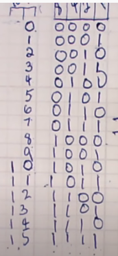

# Arduino Learning Path

## About
This repository serves as a chronological record of my progress in learning the Arduino ecosystem. Starting from the simplest "Hello World" of hardware—blinking a single LED—it evolves into more complex implementations involving analog signal processing and peripheral integration. The journey culminates in a password-protected digital lock, demonstrating a shift from basic circuit experimentation to building a cohesive, functional system.

## Technical Details
The projects are implemented in C++ using the Arduino framework. The progression covers several core embedded systems concepts:

- **Digital Logic**: Basic GPIO control, Morse code timing, and binary counting.
- **Analog Interfacing**: Use of the ADC to interpret potentiometers and joysticks. Voltage is derived using the 10-bit resolution formula: $V_{out} = \frac{5.0}{1023} \times \text{ReadValue}$.
- **Peripheral Integration**: Utilizing the I2C protocol for LCD communication and managing a 4x4 matrix keypad for user input.
- **Hardware Stack**: The projects utilize a variety of components, including RGB LEDs, 7-segment displays, 10k resistors, potentiometers, and 5V relays.

## Execution
1. Install the Arduino IDE.
2. For the digital lock project (`mainmain`), install the `LiquidCrystal_I2C` and `Keypad` libraries via the Library Manager.
3. Open the `.ino` file for the specific project you wish to test.
4. Wire the circuit based on the pin assignments defined in the code (refer to the global variable declarations and `setup()` function for pin mappings).
5. Upload the sketch to your Arduino board.